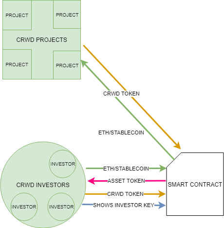
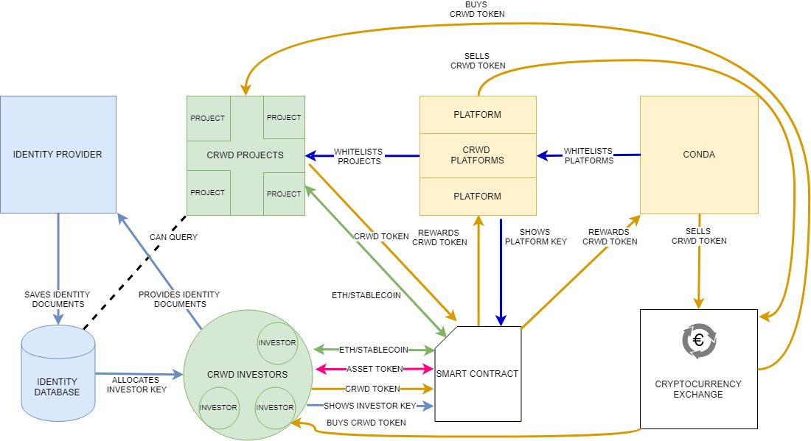

# CONDA AssetToken

Conda Crowdinvesting is prowd to share the first parts of the CRWD ecosystem. We bring Crowdinvesting to the blockchain! It is currently an alpha version. For any questions and improvement ideas just open a Github issue.

If you want to invest please visit [http://ico.conda.online/](http://ico.conda.online/)

Those so called *Smart Contracts* are written in a Javascript-like language called *Solidity* with a framework called [OpenZeppelin Solidity](https://github.com/OpenZeppelin/openzeppelin-solidity) which is state of the art for blockchain programming

## Quickstart

Clone the repository and run inside the cloned folder in console/terminal 

```npm install```

As IDE you can use e.g. [VisualStudio Code](https://code.visualstudio.com/download) or whatever you prefer instead

To compile the tests run

```truffle compile```

### Testing the contracts

The easiest way to get started without syncing the whole blockchain to your PC is to install [ganache-cli](https://github.com/trufflesuite/ganache-cli)

Run ganache in a separate window like this:

```ganache-cli```

Then just run :

```truffle test```

To run test coverage run (does not require separate ganache-cli window):

```./node_modules/.bin/solidity-coverage```

## About
The CRWD Network is launched by CONDA Crowdinvesting to establish a standardized protocol to offer regulated financial products on top of an open blockchain. Through KYC verification, wallet addresses can be linked to a customer's real world identity, allowing for new, legal ways of asset type fundraising directly on the blockchain. The newly established decentralized network of crowdinvesting platforms achieves this without handling any fiat currency, which makes it easy to scale across countries and jurisdictions.

More general technical information see the [Technical Whitepaper](http://ico.conda.online/)

## About AssetToken
Once a company has launched its fundraising on the
CRWD Network, it issues a tokenized equity offering also commonly
referred to as asset token. This token represents the company’s
liability to its investors and can come in the form of any financial
instrument like a share or a bond. It is generated automatically for
each new project on the network and can be traded and held within
identified Ethereum wallets.

The AssetToken has the following Stakeholders (high level view):


Investors want to invest in business ideas and trade asset tokens. Companies want to get funded. Companies issue AssetToken specifically for their project that needs funding that investors receive. Owning investor keys entitles an investor to receive dividends. 

This also enables new possibilities like a (planned) voting mechanism for investores to co-determine their trusted company/project.

To manage this funding/investment process on the Blockchain so called *Smart Contracts* are required:



### The Conda AssetToken consists of

**Smart Contracts:**

- BasicAssetToken
  - CRWDAssetToken
    - DividendAssetToken
    - EquityAssetToken
- DividendAssetTokenGenerator
- EquityAssetTokenGenerator


Disclaimer: Keep in mind that the figure above is a simplified representation where many details are left out. The truth lies in the code :)

### BasicAssetToken
Does conceptionally but not in practice inherit from [ERC20](https://github.com/ethereum/eips/issues/20) but has all it's method signatures and is therefore an ERC20 token and has similar functionality. It also conceptionally inherits from Mintable and entitled contract controllers like the creator may mint until finishMinting is called

### CRWDAssetToken
 Inherits from BasicAssetToken. The CRWDAssetToken is responsible for clearing which means paying e.g. platform providers to ensure a good crowdinvesting ecosystem. Crowdsales can be certified in clearing which gives them a higher value.

### DividendAssetToken
Inherits from CRWDAssetToken and therefore also from BasicAssetToken and adds functionality to pay dividends. The inheritance is mainly for separation of concerns the DividendAssetToken is the one that is really used for projects that pay out dividends. Dividends can be deposited and claimed. Unclaimed dividends get recycled and are evenly distributed (this is to avoid sending to dead addresses)

### EquityAssetToken
Inherits from CRWDAssetToken and therefore also from BasicAssetToken and adds functionality to pay dividends. The inheritance is mainly for separation of concerns the EquityAssetToken is the one that is really used (besides DividendAssetToken). The owner of this contract is only important until the token is set to configured. During this phase he can set metadata information. When the EquityAssetToken is set to configured (which is one-way only) the ownership is transfered to capitalControl (which is a notary or other trusted entity). The capitalControl can mint/burn balances.

### AssetTokenGenerator(s)
The AssetTokenGenerator contracts have the main responsibility of generating tokens and remembering them

# How it's connected
The AssetToken shared in this repository is one essential part of the CRWD Network which has various areas and will build upon a row of smart contracts.



More general technical information see the [Technical Whitepaper](http://ico.conda.online/)

If you want to invest please visit [http://ico.conda.online/](http://ico.conda.online/)
